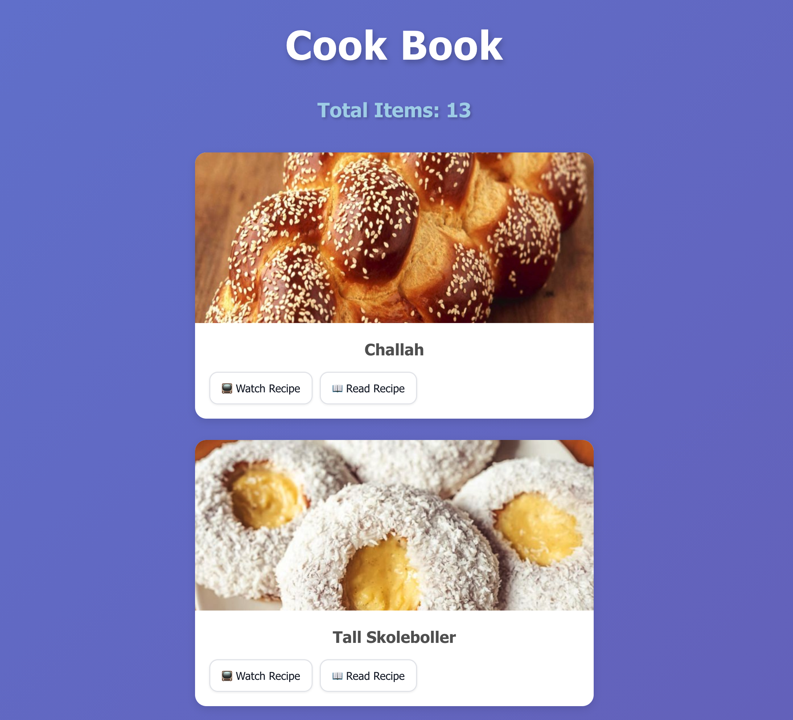

# Cookbook App
A React application that fetches and displays recipes from The MealDB API with an interactive user interface.

## 🌍 Live Demo

**[View Live App](https://cook-book-fetch.netlify.app)**

## 📸 Screenshot



## ✨ Features

- 🌎 Fetches and displays many food and shows their recipes
- 🎨 Modern card-based UI design

## 🛠️ Built With

- React
- The MealDB API
- CSS3
- Vite

## 🚀 Getting Started

```bash
# Install dependencies
npm install

# Run development server
npm run dev

# Build for production
npm run build
```

## 📚 What I Learned

- Fetching data from external APIs
- CSS card layouts and hover effects

---

**Project Type:** Learning Project  
**Date:** December 2025
